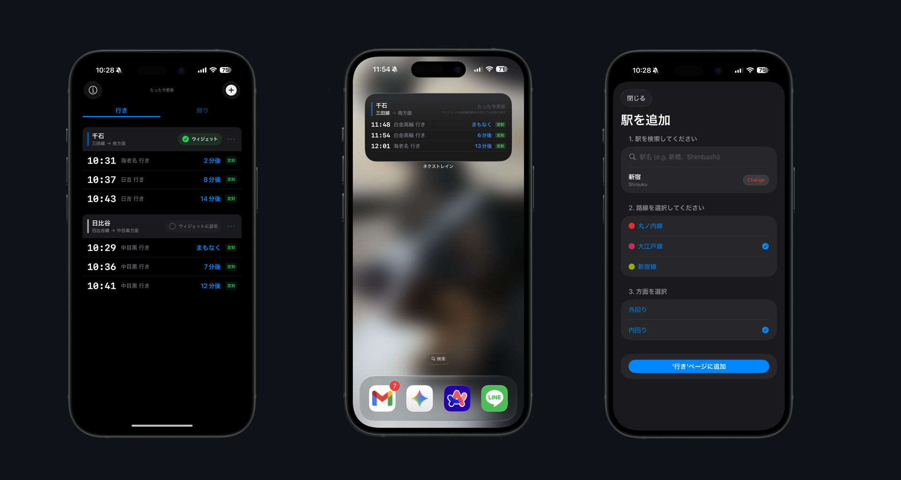

# NexTrain (ネクストレイン)
### 都内の通勤を、もっとスマートに。

**NexTrain**は、次の電車が来るまでの時間を「あと何分何秒」で正確に表示する、ミニマリストのための通勤ウィジェットアプリです。

駅の電光掲示板（発車標）を、あなたのホーム画面に。

## 🚀 特徴 (Features)

* **次の列車までカウントダウン**: 駅のホームにある電光掲示板と同じように、「あと3分」といった正確な発車までの時間を表示します。
* **ホーム画面ウィジェット**: アプリを開く必要はありません。iPhoneのホーム画面やロック画面を見るだけで、走るべきか歩くべきかが分かります。
* * **スピード重視**: 一瞬で立ち上がる、無駄の無い設計です。1秒も待ちたくない平日朝に最適な作りです。
* **プライバシーファースト**: 位置情報や利用データは集めません。外部サーバーとの通信は列車時刻を集めるためだけに行います。
* **首都圏の主要路線に対応**: 東京メトロ、都営地下鉄（三田線など）を含む首都圏の主要路線をサポート。

_**注：データの制限により、JR系などは未対応です。ご要望とデータ次第で順次拡大予定。**_

## 📱 動作環境 (Requirements)

* **iOS 18.0** 以上

## 📥 ダウンロード (Download)

App Storeから無料でダウンロードできます（現在はベータテスト中）。

## 🛠 技術スタック (Tech Stack)

* Swift 6
* SwiftUI
* WidgetKit
* App Intents

## 🔒 プライバシー (Privacy)

NexTrainはユーザーのプライバシーを尊重します。
詳細なプライバシーポリシーについては、[こちら](PRIVACY.md)をご覧ください。

* **データ収集なし**: アプリの使用状況や位置情報をサーバーに送信することはありません。
* **アカウント不要**: 面倒な登録なしで、すぐに使い始められます。

## 🐛 バグ報告・フィードバック (Support)

不具合の報告や機能リクエストは、GitHubの [Issues](https://github.com/autumn-seaweed/NexTrain/issues) ページにて受け付けています。

---

© 2026 Akinori Toyoshima. All rights reserved.
