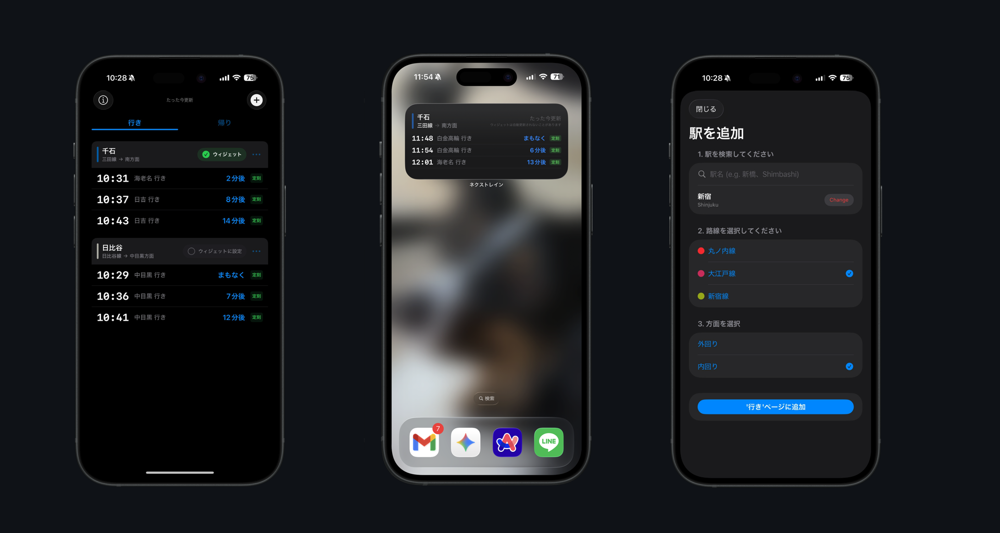

# ネクストレイン（NexTrain）
### 検索せず、次の電車をひと目で。

**NexTrain**は、よく使う駅の発車時刻をホーム画面・ロック画面のウィジェットに表示する、シンプルな乗車アプリです。検索なしで、毎日の「次の電車まであと何分か」をいちばん速く知ることに特化しています。

## 🚀 特徴 (Features)

- ホーム画面ウィジェット（小・中サイズ）
- ロック画面ウィジェット（横長・インライン・サークル）
- 発車時刻、あと何分か、両数を表示（遅延情報が提供されている場合は遅れも表示）
- 「行き」「帰り」をワンタップで切り替え
- 時間帯で表示を自動切り替え（例：平日の昼までは「行き」、以降は「帰り」、週末は「行き」）

_**注：公共交通オープンデータ（ODPT）を元に開発しているため、JR系などは未対応です。オープンデータが拡大され次第、対応路線を拡大致します。**_

## 対応路線（2026年7月時点）
* **都営地下鉄**: 浅草線、三田線、大江戸線、新宿線
* **東京メトロ**：千代田線、副都心線、銀座線、半蔵門線、日比谷線、丸ノ内線、丸ノ内線支線、南北線、東西線、有楽町線
* **その他**: りんかい線、ゆりかもめ、日暮里・舎人ライナー、東京さくらトラム（都電荒川線）

## プレミアム（買い切り・¥500）
基本機能は無料です。一度の購入で、次の機能がずっと使えます。
- ルートの登録数 無制限（行き・帰り・複数の路線）
- Apple Watch アプリ（手首で発車時刻を確認）

継続課金（サブスクリプション）ではありません。

## 📱 動作環境 (Requirements)

* **iOS 18.0** 以上
* **watchOS 11.0** 以上

## 📥 ダウンロード (Download)

App Storeから無料でダウンロードできます。

## 👨‍💻 開発者について (About the Developer)

NexTrainは、東京在住の個人開発者が1人で開発・運営しています。
「自分の毎朝の通勤を少しでも快適にしたい」という思いで作りました。

もしこのアプリを気に入っていただけたら、**プレミアム**へのアップグレードや、ストアでの**★5レビュー**をいただけると、開発を続ける大きな励みになります！

不具合や要望があれば、お気軽にGitHub Issues、もしくはメールまでご連絡ください。

## 🔒 プライバシー (Privacy)

NexTrainはユーザーのプライバシーを尊重します。
詳細なプライバシーポリシーについては、[こちら](PRIVACY.md)をご覧ください。

* **データ収集なし**: アプリの使用状況や位置情報をサーバーに送信することはありません。
* **アカウント不要**: 面倒な登録なしで、すぐに使い始められます。

## 🐛 バグ報告・フィードバック (Support)

不具合の報告や機能リクエストは、GitHubの [Issues](https://github.com/autumn-seaweed/NexTrain/issues) ページにて受け付けています。

---

© 2026 Akinori Toyoshima. All rights reserved.
